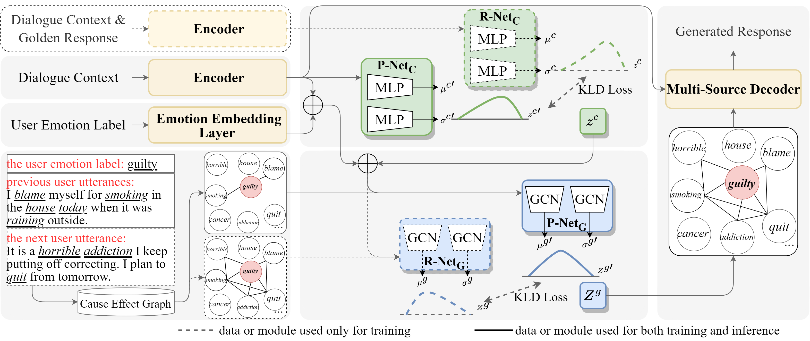

## CARE: Causality Reasoning for Empathetic Responses by Conditional Graph Generation
 [](https://opensource.org/licenses/MIT) 


This is the PyTorch implementation of the paper:

[**CARE: Causality Reasoning for Empathetic Responses by Conditional Graph Generation**](https://aclanthology.org/2022.findings-emnlp.51/). [**Jiashuo WANG**](http://www4.comp.polyu.edu.hk/~csjwang/), Yi CHENG, [**Wenjie LI**](https://www4.comp.polyu.edu.hk/~cswjli/), EMNLP 2022

If you use our codes or your research is related to our work, please kindly cite our paper:

```bib
@inproceedings{wang-etal-2022-care,
    title = "{CARE}: Causality Reasoning for Empathetic Responses by Conditional Graph Generation",
    author = "Wang, Jiashuo  and
      Cheng, Yi  and
      Li, Wenjie",
    booktitle = "Findings of the Association for Computational Linguistics: EMNLP 2022",
    month = dec,
    year = "2022",
    address = "Abu Dhabi, United Arab Emirates",
    publisher = "Association for Computational Linguistics",
    url = "https://aclanthology.org/2022.findings-emnlp.51",
    pages = "729--741",
```


## Abstract
Recent approaches to empathetic response generation incorporate emotion causalities to enhance comprehension of both the user's feelings and experiences. However, these approaches suffer from two critical issues. 
First, they only consider causalities between the user's emotion and the user's experiences, and ignore those between the user's experiences. 
Second, they neglect interdependence among causalities and reason them independently.
To solve the above problems, we expect to reason all plausible causalities interdependently and simultaneously, given the user's emotion, dialogue history, and future dialogue content. Then, we infuse these causalities into response generation for empathetic responses. 
Specifically, we design a new model, i.e., the Conditional Variational Graph Auto-Encoder (CVGAE), for the causality reasoning, and adopt a multi-source attention mechanism in the decoder for the causality infusion. We name the whole framework as **CARE**, abbreviated for **CA**usality **R**easoning for **E**mpathetic conversation.
Experimental results indicate that our method achieves state-of-the-art performance. 

## CARE Architecture:
<p align="center">

</p>

## Preparing Environment
```bash
conda env create -f env.yml -n CARE
conda activate CARE
```
## Downloading Dataset
Download [**EmpatheticDialogues**](https://github.com/HLTCHKUST/MoEL/tree/master/empathetic-dialogue) processed by MoEL: inside folder ./data/empathetic-dialogue/. 

Download [**Cause Effect Graph**](https://github.com/eecrazy/CausalBank): **Cause Effect Graph** inside folder ./data/Cause_Effect_Graph/. We also provide a [**Cause Effect Graph (smaller size)**](https://drive.google.com/file/d/1UQSPh-dT3K1tTyWadk6D6vCjHEfaKKLT/view?usp=sharing) by filtering some tuples with low causal relation scores (necessity causality score + sufficiency causality score<0.03).

Download [**Pre-trained glove embedding**](http://nlp.stanford.edu/data/glove.6B.zip): ***glove.6B.300d.txt*** inside folder ./data/glove.6B/.

## Experiment
### Processing Data
```console
❱❱❱ python data/data_process.py
```
***Quick Processed Data***
This process may take around 8 hours. To skip it, please download [**data_preproc.p**](https://drive.google.com/file/d/1jCvXz1opZtoblpu3yaTPsucy8F5pX_Iw/view?usp=sharing) and [**graph_preproc.p**](https://drive.google.com/file/d/1A_JGzNgUrMKrF_vplOSBhYzqPN3d8R_v/view?usp=sharing) inside ./data/.

### Training the Model
Run `bash RUN/train.sh` to train the model.

### Testing the Model
Run `bash RUN/test.sh` to train the model (change the *--recover_path* and *--save_path*).

***Quick Checkpoint and Result***
To skip training and testing, please check [**GARE**](https://drive.google.com/file/d/1dfqL1uCgZRpIoWK8fHqmjxvHMj8fQtwA/view?usp=sharing) and ./save/***generation_results.txt***.
